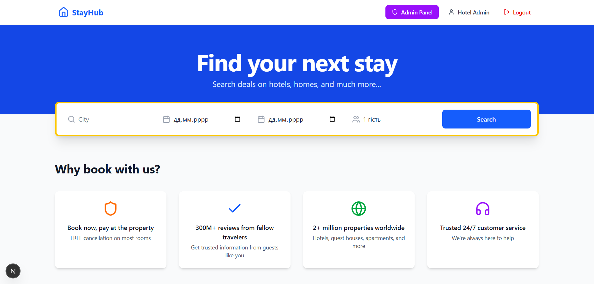

# Hotel Booking – Luxury Apartments  
**Повністю робочий веб-додаток для бронювання апартаментів преміум-класу**  
Next.js 16 (App Router) • Supabase • Tailwind CSS • TypeScript • ShadCN UI



---

### Як запустити проєкт локально (покроково)

#### 1. Клонуй репозиторій
```bash
git clone https://github.com/roneslav/hottel_booking_patterns.git
cd hotel-booking
```

#### 2. Встанови залежності
npm install
# або
yarn install
# або
pnpm install

#### 3. Створи файл .env.local
NEXT_PUBLIC_SUPABASE_URL=https://твій-проєкт.supabase.co
NEXT_PUBLIC_SUPABASE_ANON_KEY=твій-anon-key
SUPABASE_SERVICE_ROLE_KEY=твій-service-role-key
NEXT_PUBLIC_BASE_URL=http://localhost:3000

#### 4. Запусти проєкт
npm run dev
# або
yarn dev

#### 5. Відкрий у браузері: http://localhost:3000

Тестові акаунти
Роль,Email,Пароль,Посилання
Адмін,hotel_admin@gmail.com,123456,Увійти
Користувач,hotel_test@gmail.com,123456,Увійти

Структура проєкту

app/
├── (public)/           → Сторінки для всіх
├── account/            → Особистий кабінет
│   ├── bookings/
│   ├── profile/
│   └── page.tsx
├── admin/              → Адмін-панель (захищена)
│   ├── reports/
│   └── page.tsx (дашборд)
├── api/
│   └── account/update-profile/route.ts
lib/
├── supabase/server.ts  → createServerClient з куками
components/
└── ui/                 → ShadCN компоненти